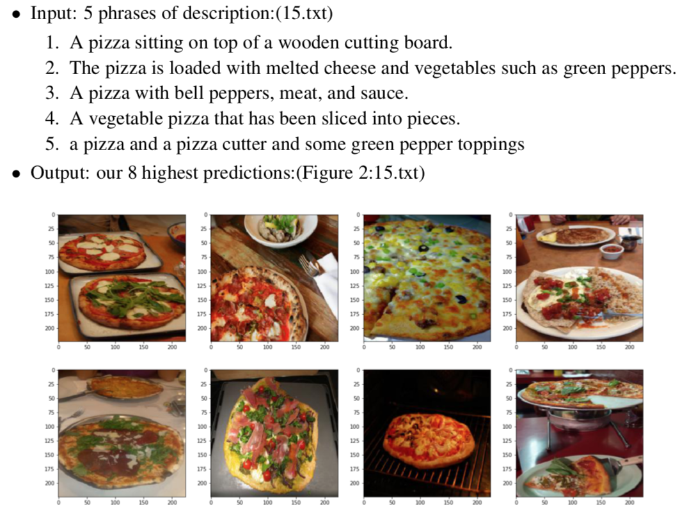
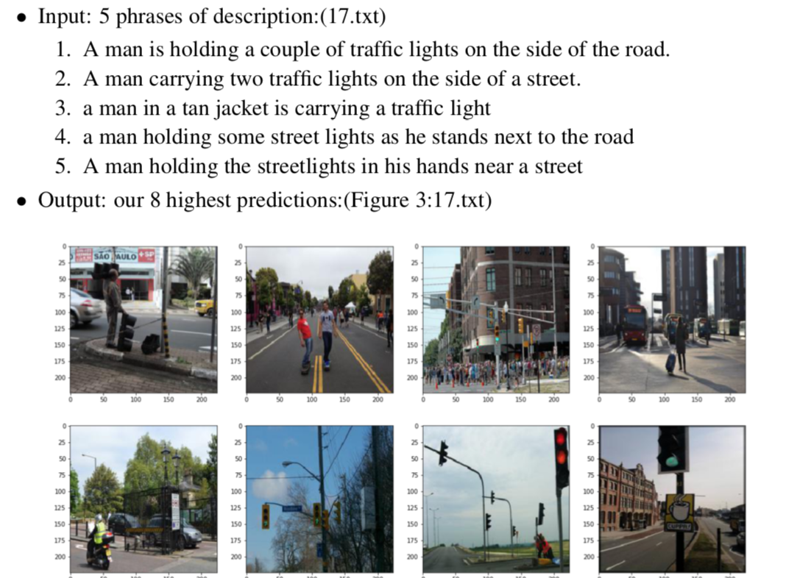

# Large-Scale Image Search Engine

Our image search engine will search for relevant images given a natural language query. For instance, if a user types "dog jumping to catch frisbee," our system will rank-order the most relevant images from a large database.

### Data

During training, we have a dataset of 10,000 samples. Each sample has the following data available for learning:
* A 224x224 JPG image.
* A list of tags indicating objects appeared in the image.
* Feature vectors extracted using ResNet, a state-of-the-art Deep-learned CNN . The features are extracted from pool5 and fc1000 layer.
* A five-sentence description.

During testing, our system matches a single five-sentence description against a pool of 2,000 candidate samples from the test set. Each sample has:
* A 224x224 JPEG image.
* A list of tags for that image.
* ResNet feature vectors for that image.

### Engine Flow Chart

### Searching Examples

### Evaluation Metric
There are 2,000 descriptions, and for each description, we need to compare against the entire 2,000-image test set. That is, rank-order test images for each test description. We will use MAP@20 as the evaluation metric. If the corresponding image of a description is among our algorithm's 20 highest scoring images, this metric gives us a certain score based on the ranking of the corresponding image. Please refer to the evaluation page for more details. 

